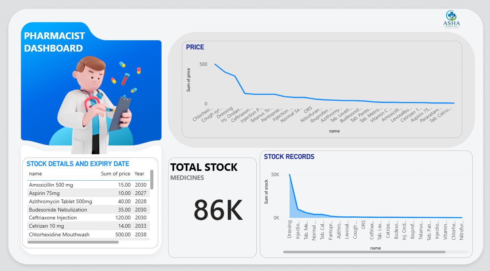

# 💊 Pharmacist Dashboard | Power BI

## 📌 Project Overview

The Pharmacist Dashboard is an interactive Power BI solution developed to monitor medicine inventory, stock levels, pricing, and expiry dates. This dashboard helps pharmacists and healthcare organizations manage pharmaceutical stock efficiently through data-driven insights and visual analytics.

---

## 🎯 Objectives

- Track medicine stock availability
- Monitor medicine prices
- Manage expiry dates
- Improve inventory visibility
- Support pharmacy decision-making
- Reduce medicine wastage

---

## 📊 Dashboard Features

### 📦 Total Stock KPI
Displays the total quantity of medicines currently available in inventory.

**Current Total Stock: 86K Units**

### 💰 Price Analysis
Provides a visual representation of medicine prices, helping identify high-value and low-value medicines.

### 📈 Stock Records Analysis
Displays stock distribution across different medicines and highlights inventory trends.

### 📅 Expiry Date Monitoring
Tracks medicine expiry years to help prevent losses caused by expired stock.

### 📋 Stock Details Table
Includes:
- Medicine Name
- Price
- Expiry Year

---

## 🛠️ Tools & Technologies Used

- Microsoft Power BI
- MySQL Database
- Power Query
- DAX (Data Analysis Expressions)
- Data Modeling

---

## 📂 Dataset Information

The dashboard is built using pharmacy inventory data containing:

| Field | Description |
|---------|-------------|
| Medicine Name | Name of the medicine |
| Price | Cost of the medicine |
| Stock Quantity | Available stock |
| Expiry Year | Expiration year of medicine |

---

## 📷 Dashboard Preview



---

## 📈 Key Insights

- Real-time visibility of medicine inventory
- Easy identification of low-stock medicines
- Monitoring of high-cost medicines
- Better expiry date management
- Improved inventory planning

---

## 📁 Project Structure

```text
Pharmacist-Dashboard/
│
├── Dashboard.pbix
├── README.md
├── Screenshots/
│   └── pharmacist-dashboard.png
└── Dataset/
```

---

## 🚀 Future Improvements

- Low Stock Alert System
- Expiry Alert Notifications
- Supplier Analytics Dashboard
- Medicine Sales Analysis
- Automated Inventory Forecasting
- Real-Time Database Integration

---

## 💡 Business Benefits

- Reduces medicine wastage
- Improves stock management
- Enhances operational efficiency
- Supports data-driven decisions
- Improves pharmacy inventory control

---

## 👨‍💻 Author

**Arjun**

Power BI Developer | Data Analytics Enthusiast

### Skills
- Power BI
- MySQL
- SQL
- Data Visualization
- Dashboard Design
- Data Analytics

---

## ⭐ GitHub Repository

If you found this project useful, consider giving it a ⭐ on GitHub.

---

## 📄 License

This project is created for educational, portfolio, and demonstration purposes.
